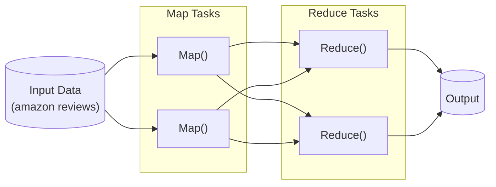
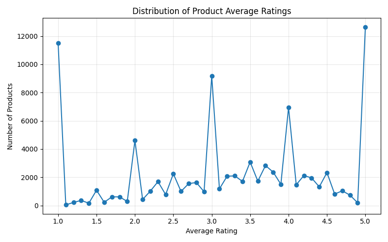
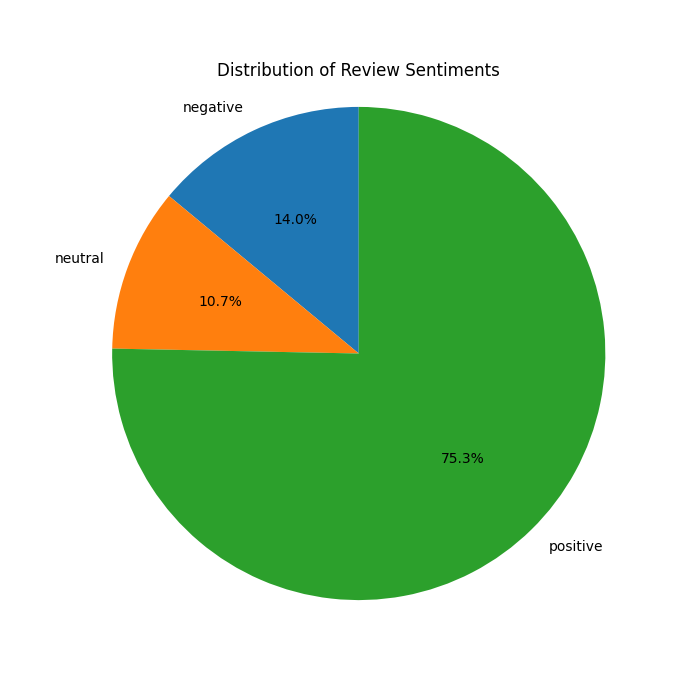
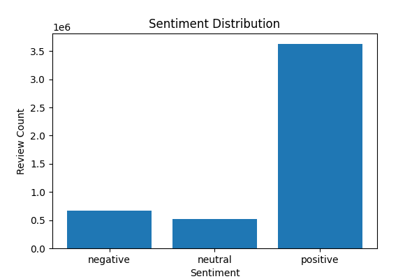

# Amazon Reviews Analysis Using MapReduce

# Overview

This project demonstrates the use of the [MapReduce programming model](https://en.wikipedia.org/wiki/MapReduce) for large-scale data analysis using the [Amazon Reviews 2023 Dataset](https://amazon-reviews-2023.github.io/). The implementation is developed using Python's [mrjob](https://mrjob.readthedocs.io/) library, enabling MapReduce jobs to be executed locally or on distributed systems such as [Apache Hadoop](https://hadoop.apache.org/).



The project analyzes customer reviews to extract useful insights, including the number of reviews per product, average product ratings, the most reviewed products, review helpfulness, and customer sentiment.

# Dataset

The project uses the Amazon Reviews Dataset collected in 2023 by [McAuley Lab](https://cseweb.ucsd.edu/~jmcauley/), a large-scale collection of Amazon product reviews and metadata compiled for recommendation systems and data mining research.

The complete dataset contains over [571 million reviews and ratings](https://amazon-reviews-2023.github.io/#what-s-new) collected from Amazon products across multiple categories. 

> However, because processing the entire dataset would require substantial computational resources, this project uses **only the Software category dataset**. 
> This subset contains reviews and ratings for software products sold on Amazon and serves as the basis for all analyses presented in this project.

The Software review dataset contains the following fields:

| Field             | Type  | Explanation                                             |
| ----------------- | ----- | ------------------------------------------------------- |
| rating            | float | Rating of the product (from 1.0 to 5.0).                |
| title             | str   | Title of the user review.                               |
| text              | str   | Text body of the user review.                           |
| asin              | str   | ID of the product.                                      |
| parent_asin       | str   | Parent ID of the product(used to find product metadata) |
| user_id           | str   | ID of the reviewer.                                     |
| timestamp         | int   | Time of the review (Unix time).                         |
| verified_purchase | bool  | Indicates whether the purchase was verified by Amazon.  |
| helpful_vote      | int   | Number of helpful votes received by the review.         |

# Installation

1. Clone the repository:

    ```bash
    git clone https://github.com/4Solome/Data-Mining-Project.git

    cd Data-Mining-Project
    ```

2. Create a virtual environment:

    ```bash
    python3 -m venv venv
    ```

    Activate the environment.

    Windows:

    ```bash
    venv\Scripts\activate
    ```

    Linux/Mac:

    ```bash
    source venv/bin/activate
    ```

3. Install dependencies:

    ```bash
    pip install -r requirements.txt
    ```

    or

    ```bash
    pip install mrjob nltk pandas matplotlib jupyterlab
    ```

4. Download archived [dataset](https://mcauleylab.ucsd.edu/public_datasets/data/amazon_2023/raw/review_categories/Software.jsonl.gz) and [metadata] (https://mcauleylab.ucsd.edu/public_datasets/data/amazon_2023/raw/meta_categories/meta_Software.jsonl.gz)

    or use 

    ```sh
    # dataset
    curl  -sSL -o data/software-clean.jsonl.qz https://mcauleylab.ucsd.edu/public_datasets/data/amazon_2023/raw/review_categories/Software.jsonl.gz
    # metadata
    curl  -sSL -o data/meta_software.jsonl.qz https://mcauleylab.ucsd.edu/public_datasets/data/amazon_2023/raw/meta_categories/meta_Software.jsonl.gz
    ```

    Extract archives with:

    ```sh
    cd data
    gunzip -k software.jsonl.qz
    gunzip -k software.jsonl.qz
    ```

    and move them to `data/` folder like:

    ```sh
    $ tree -h data
    [4.0K]  data
    ├── [244M]  meta_software.jsonl
    ├── [ 61M]  meta_software.jsonl.gz
    ├── [1.7G]  software.jsonl
    └── [473M]  software.jsonl.gz
    ```

5. At this point, your setup is done and ready to run MapReduce jobs 

# Tasks

## 1. Setup and preparation

To setup the project, follow the [installation guide](#installation) above.
Its important that we examine and understand the dataset strucuure and set the stage before performing large-scale analysis.
A [Python script](./scripts/dataset.py) for this is included and when run give an output we stored in [results/dataset.txt](./results/dataset.txt).

To see the basic analysis of the dataset, run:
```sh
python scripts/dataset.py
```
The output has been saved in [results/dataset.txt](./results/dataset.txt) to compare with your results.

For an exploratory data analysis of the dataset as well as preprocessing, the [notebooks/data-preprocessing](notebooks/data-preprocessing.ipynb) notebook hanldes that. A clean dataset will be saved as `data/software-clean.jsonl`.

## 2. Count reviews per product

In the [reviews/reviews.py](./reviews/reviews.py) job, the mapper emits a key-value pair consisting of the product identifier and the value 1 for every review. The reducer aggregates all values associated with each product and computes the total number of reviews.

```bash
python jobs/reviews.py data/software-clean.jsonl > results/reviews_count.csv
```

> This command runs the job and saves the output to a csv file: [reviews/counts.csv](./reviews/counts.csv)

## 3. Average star rating per product

For this [jobs/average_raitng.py](./jobs/average_raitng.py) job, the mapper emits the product identifier and its corresponding rating. The reducer computes the average by dividing the sum of ratings by the total number of ratings for each product.

```bash
python jobs/average_rating.py data/software-clean.jsonl > results/avg_ratings.csv
```

> See result in [reviews/avg_ratings.csv](./reviews/avg_ratings.csv)

## 4. Top 10 most reviewed products

The [jobs/top_ten.py](./jobs/top_ten.py) job is split into 2 steps, one for counting reviews per product and another retains only the products with the highest review counts and outputs the top ten entries.

```bash
python jobs/top_ten.py data/software-clean.jsonl > results/top_ten.csv
```

> See result in [reviews/top_ten.csv](./reviews/top_ten.csv)

## 5. Average helpfulness score

The [jobs/helpfulness.py](./jobs/helpfulness.py) job takes each review and a helpfulness score is calculated using the ratio of helpful votes to total votes. Reviews with zero votes are excluded to avoid division-by-zero errors. The reducer computes the overall average helpfulness score across all software product reviews.

```bash
python jobs/helpfulness.py data/software-clean.jsonl > results/helpfulness.csv
```

> See results in [reviews/helpfulness.csv](./reviews/helpfulness.csv)


## 6. Sentiment analysis

Lastly, the [jobs/sentiment.py](jobs/sentiment.py) job uses the VADER sentiment analyzer to compute a sentiment score for each review. Reviews with compound scores greater than 0.05 are classified as positive, scores below -0.05 are classified as negative, and scores between these thresholds are classified as neutral. The reducer aggregates the counts for each sentiment category.

```bash
python jobs/sentiment.py data/software-clean.jsonl > results/sentiment.csv
```

> See results in [reviews/sentiment.csv](./reviews/sentiment.csv)
>

# Results 
All the results were exported as CSV files under [results](./results/) folder. 
This allows for exploratory results analysis which is carried out in [notebooks/results-eda.ipynb](./notebooks/results-eda.ipynb).

To run the EDA, start jupyter server:
```bash
jupyter lab
```

Open [notebooks/results-eda.ipynb](./notebooks/results-eda.ipynb) notebook

The visualizations and iniights generated inlcude:








# Conclusion

This project successfully demonstrates the use of the MapReduce paradigm for analyzing large-scale Amazon review data. Using the mrjob framework, several distributed data-processing tasks were implemented, including review aggregation, rating analysis, helpfulness computation, ranking products by popularity, and sentiment classification.

Due to computational limitations, the analysis was restricted to the Software category of the Amazon Reviews 2023 Dataset. Despite this limitation, the project effectively showcases how MapReduce can process large volumes of review data and generate meaningful insights from customer feedback.

# References

1. McAuley, J., et al. *Amazon Reviews 2023 Dataset.* https://amazon-reviews-2023.github.io/
2. Dean, J., & Ghemawat, S. (2008). *MapReduce: Simplified Data Processing on Large Clusters.* https://static.googleusercontent.com/media/research.google.com/es/us/archive/mapreduce-osdi04.pdf
3. mrjob Documentation: https://mrjob.readthedocs.io/
4. NLTK *SentimentAnalyzer Documentation* https://www.nltk.org/api/nltk.sentiment.SentimentIntensityAnalyzer.html#nltk-sentiment-sentimentintensityanalyzer.
